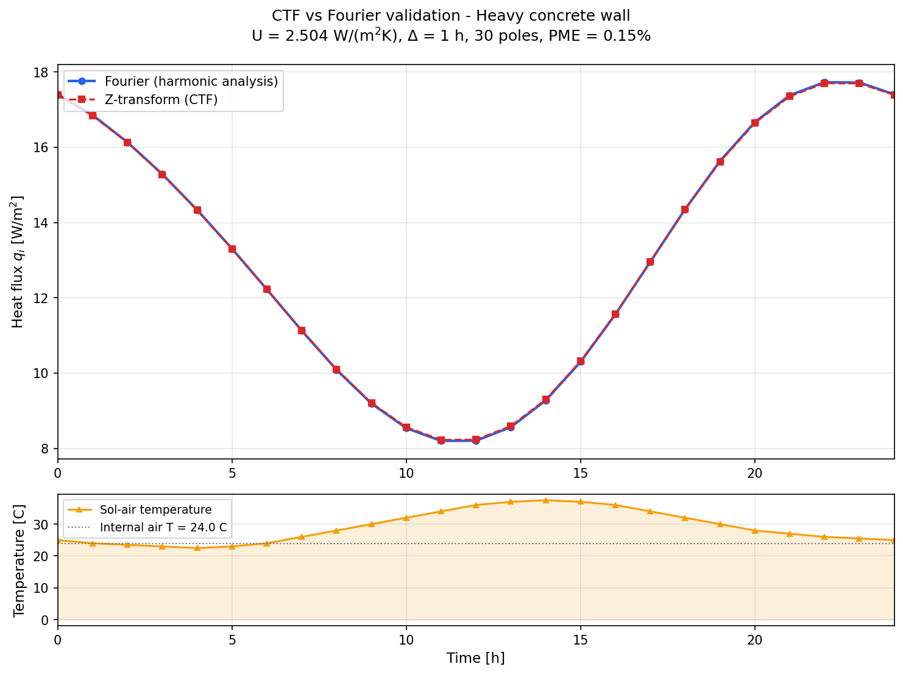

# wall-ctf (CATI) - Conduction Transfer Function Coefficients

**Version 1.0.0** | **Author:** Valerio Lo Brano, Universita degli Studi di Palermo

CATI computes the Conduction Transfer Function (CTF) coefficients for
multilayer wall assemblies using the Z-transform method. This is the same
mathematical approach used by TRNSYS, DOE-2, BLAST, TARP, and the ASHRAE
Transfer Function Method (TFM) for dynamic thermal simulation of buildings.

Given the thermophysical properties of a wall (layer thicknesses, densities,
specific heats, conductivities), CATI determines the Z-domain transfer function
coefficients that allow to compute, at each time step, the heat flux at the
internal surface as a function of the external (sol-air) temperature history
and the internal air temperature.



*Comparison between the Z-transform (CTF) and Fourier (harmonic analysis)
solutions for a heavy concrete wall (plaster 2cm + concrete 25cm + plaster 2cm).
The two curves are virtually indistinguishable, with a Percentage Mean Error
of 0.15%.*

---

## Table of contents

- [Theoretical background](#theoretical-background)
- [Installation](#installation)
- [Quick start](#quick-start)
- [Input format](#input-format)
- [Parameters and guidelines](#parameters-and-guidelines)
- [Examples](#examples)
- [Validation](#validation)
- [How to cite](#how-to-cite)
- [License](#license)

---

## Theoretical background

### The thermal transmission matrix

The non-steady-state heat transfer through a homogeneous isotropic layer can
be described in the Laplace domain by a 2x2 transmission matrix that relates
temperatures and heat fluxes on the two sides of the layer:

```
| T_e |   | a  b |   | T_i |
|     | = |      | x |     |
| Q_e |   | c  d |   | Q_i |
```

where, for a material layer of thickness *L*, conductivity *k*,
density *rho*, specific heat *Cp*, and diffusivity *alpha = k/(rho\*Cp)*:

```
a = d = cosh(L * sqrt(s/alpha))
b = sinh(L * sqrt(s/alpha)) / (k * sqrt(s/alpha))
c = k * sqrt(s/alpha) * sinh(L * sqrt(s/alpha))
```

For surface resistance layers (convective + radiative films) and air gaps,
the matrix reduces to `[[1, R], [0, 1]]` where *R* is the thermal resistance.

For a multilayer wall, the overall matrix **M(s)** is the ordered product of
all individual layer matrices, from the external surface to the internal one.

### From Laplace to Z-domain

The heat flux at the internal surface can be expressed as:

```
Q_i(z) = [1/B(z)] * T_e(z) - [A(z)/B(z)] * T_i(z)
```

where A and B are elements of the overall transmission matrix. The Z-transform
coefficients are obtained through:

1. Finding the poles *s_n* (zeros of B(s) on the negative real axis)
2. Heaviside partial-fraction expansion of the ramp response
3. **Procedure I**: optimal selection of significant poles/residues
4. Computation of the Z-domain denominator and numerator polynomials

The resulting recursive formula is:

```
q_i(n*Delta) = SUM_j  b_j * T_e((n-j)*Delta)
             - SUM_j  d_j * q_i((n-j)*Delta)
             - T_i * SUM_j c_j
```

### Procedure I: optimal pole selection

As demonstrated in Ref. [2], for massive building walls typical of the
Mediterranean architectural heritage, a naive application of the TFM with
many poles can produce **worse** results than using fewer poles. The Percentage
Mean Error (PME) can increase from < 1% to > 1000% when using 15 poles
instead of 5.

CATI implements **Procedure I** from Ref. [2]: residues are sorted by absolute
value in descending order, and only those above a significance threshold
(|res_n| > 10^-10) are retained. This guarantees PME < 1% for all standard
wall constructions at 1-hour sampling period.

---

## Installation

### With uv (recommended)

[uv](https://docs.astral.sh/uv/) is the fastest way to manage Python projects:

```bash
# Clone the repository
git clone https://github.com/valeriolobrano/wall-ctf.git
cd wall-ctf

# Install with uv (creates virtualenv automatically)
uv sync

# Run tests
uv run pytest

# Run the CLI
uv run cati examples/heavy_wall.json

# Run with optional plotting support
uv add matplotlib
uv run python scripts/generate_figures.py
```

### With pip

```bash
pip install wall-ctf
```

Or from source:

```bash
git clone https://github.com/valeriolobrano/wall-ctf.git
cd wall-ctf
pip install .

# With plotting support
pip install ".[plot]"
```

### Requirements

- Python >= 3.12
- NumPy >= 1.26
- matplotlib >= 3.8 (optional, for plotting)

---

## Quick start

### Basic example: single wall

```python
from cati import Wall, Layer, compute_ctf

# Define a wall from outside to inside:
#   external surface resistance -> material layers -> internal surface resistance
# All values in SI units
wall = Wall(layers=[
    Layer(name="External surface", resistance=0.04),       # m2*K/W
    Layer(name="Concrete", thickness=0.25, density=2400,   # m, kg/m3
          specific_heat=1000, conductivity=1.4),           # J/(kg*K), W/(m*K)
    Layer(name="Internal surface", resistance=0.13),
])

result = compute_ctf(wall, n_roots=30, n_coefficients=20)

print(f"U-value: {result.thermal_transmittance:.3f} W/(m2*K)")
print(f"Significant poles: {result.n_poles}")
print(f"Effective coefficients: {result.n_coefficients}")
```

### With Fourier validation

```python
import numpy as np

# 24-hour sol-air temperature profile (hourly, 25 values with wrap-around)
profile = np.array([
    25.0, 24.0, 23.5, 23.0, 22.5, 23.0,   # 0h-5h
    24.0, 26.0, 28.0, 30.0, 32.0, 34.0,   # 6h-11h
    36.0, 37.0, 37.5, 37.0, 36.0, 34.0,   # 12h-17h
    32.0, 30.0, 28.0, 27.0, 26.0, 25.5,   # 18h-23h
    25.0,                                   # 24h = 0h
])

result = compute_ctf(
    wall,
    n_roots=30,
    n_coefficients=20,
    temperature_profile=profile,
    T_int=24.0,              # constant internal temperature [C]
    sampling_time=1.0,       # sampling period [hours]
    n_periods=20,            # periods to exit transient
    validate_fourier=True,   # compare with harmonic solution
)

print(f"Fourier validation error: {result.fourier_error:.2f}%")
# Output: Fourier validation error: 0.15%
```

### Using the CTF coefficients in a simulation

```python
nc = result.n_coefficients  # number of effective coefficients
b = result.b_coeffs[:nc+1]  # numerator for external temperature
c = result.c_coeffs[:nc+1]  # numerator for internal temperature
d = result.d_coeffs[:nc+1]  # denominator (common)

# Simulation loop (hourly time step)
T_int = 24.0
q = np.zeros(8760)  # one year, hourly

for n in range(1, 8760):
    # b * T_external (convolution)
    q[n] = sum(b[j] * T_ext_hourly[max(0, n-j)] for j in range(nc+1))
    # - d * q_past (recursive feedback)
    q[n] -= sum(d[j] * q[max(0, n-j)] for j in range(1, nc+1))
    # - c * T_internal (constant offset)
    q[n] -= T_int * sum(c)
```

### Parallel computation for multiple walls

```python
from cati import compute_ctf_batch

# Compute CTF for all walls of a building in parallel
walls = [wall_north, wall_south, wall_east, wall_west, roof, floor]
results = compute_ctf_batch(walls, n_roots=30, n_coefficients=20)

for wall, result in zip(walls, results):
    print(f"{wall.name}: U={result.thermal_transmittance:.3f}, "
          f"poles={result.n_poles}, coeffs={result.n_coefficients}")
```

### Command-line interface

```bash
# Compute and print CTF coefficients as JSON
uv run cati examples/heavy_wall.json --roots 30 --coefficients 20

# Save results to file
uv run cati examples/heavy_wall.json -o results.json

# Custom parameters
uv run cati wall.json --sampling-time 2 --periods 30 --t-int 26

# Skip Fourier validation (faster)
uv run cati wall.json --no-fourier
```

### Loading walls from JSON

```python
from cati import Wall

# From a JSON file
wall = Wall.from_json("examples/heavy_wall.json")

# From a Python dictionary
wall = Wall.from_dict({
    "name": "My wall",
    "layers": [
        {"name": "Ext", "resistance": 0.04},
        {"name": "Brick", "thickness": 0.12, "density": 1700,
         "specific_heat": 800, "conductivity": 0.84},
        {"name": "Int", "resistance": 0.13},
    ]
})
```

---

## Input format

### JSON wall definition

```json
{
    "name": "Concrete wall with plaster",
    "layers": [
        {"name": "External surface", "thickness": 0.0, "resistance": 0.04},
        {"name": "External plaster", "thickness": 0.02, "density": 1800,
         "specific_heat": 1000, "conductivity": 0.9},
        {"name": "Concrete block", "thickness": 0.25, "density": 2400,
         "specific_heat": 1000, "conductivity": 1.4},
        {"name": "Internal plaster", "thickness": 0.02, "density": 1400,
         "specific_heat": 1000, "conductivity": 0.7},
        {"name": "Internal surface", "thickness": 0.0, "resistance": 0.13}
    ],
    "temperature_profile": [25, 24, 23.5, 23, 22.5, 23, 24, 26, 28, 30,
                            32, 34, 36, 37, 37.5, 37, 36, 34, 32, 30,
                            28, 27, 26, 25.5]
}
```

### Units (SI)

| Property | Unit | Description |
|---|---|---|
| `thickness` | m | Layer thickness (0 for surface resistance or air gap) |
| `density` | kg/m^3 | Material density |
| `specific_heat` | J/(kg\*K) | Specific heat capacity |
| `conductivity` | W/(m\*K) | Thermal conductivity |
| `resistance` | m^2\*K/W | Thermal resistance (for air gaps and surface films) |

### Wall structure rules

A wall must contain **at least 3 layers**:

1. **First layer**: external surface resistance (combined convective and radiative exchange coefficient)
2. **Intermediate layers**: material layers or air gaps, ordered from outside to inside
3. **Last layer**: internal surface resistance

Typical surface resistance values (EN ISO 6946):

| Surface | Resistance [m^2\*K/W] | Notes |
|---|---|---|
| External, normal exposure | 0.04 | Wind speed > 4 m/s |
| External, sheltered | 0.06 | Wind speed 1-4 m/s |
| Internal, horizontal flow | 0.13 | Vertical walls |
| Internal, upward flow | 0.10 | Floors (heating) |
| Internal, downward flow | 0.17 | Ceilings (heating) |

---

## Parameters and guidelines

| Parameter | Default | Description |
|---|---|---|
| `n_roots` | 50 | Number of zeros of B(s) to find |
| `n_coefficients` | 49 | Maximum number of Z-domain coefficients |
| `sampling_time` | 1.0 | Sampling period [hours] (must divide 24) |
| `n_periods` | 10 | Number of 24h periods for transient decay |
| `n_harmonics` | 120 | Harmonics for Fourier validation |
| `T_int` | 24.0 | Constant internal air temperature [C] |
| `use_mitalas` | True | Apply Mitalas instruction (recommended) |

### Recommendations

Based on the analysis in Ref. [2]:

1. **Do not use too many poles.** For most walls, 20-30 roots with automatic
   Procedure I selection gives optimal results. The effective number of
   poles is determined automatically.

2. **Increase the sampling period for massive walls.** For walls with total
   thickness > 0.4 m (typical of historical European buildings), a sampling
   period of 2 h may give better results than 1 h.

3. **Procedure I is enabled by default.** It sorts residues by significance
   and discards negligible ones, preventing the numerical problems that
   affect naive implementations.

4. **Check the Fourier validation error.** A PME below 5% indicates
   reliable coefficients. If the error is high, try:
   - Increasing the sampling period
   - Reducing `n_roots`
   - Checking wall data for unrealistic property values

---

## Examples

The `examples/` directory contains ready-to-use JSON wall definitions:

- **`heavy_wall.json`**: Plaster + concrete 25cm + plaster (U = 2.50 W/m^2K)
- **`insulated_wall.json`**: Insulated cavity wall with air gap (U = 0.33 W/m^2K)

Run them with:

```bash
uv run cati examples/heavy_wall.json --roots 30 --coefficients 20
```

---

## Validation

The CTF output is validated against an independent Fourier steady-state
solution (harmonic analysis using the complex thermal quadrupole). The
Percentage Mean Error (PME) is computed as in Ref. [2], Eq. (4-5):

```
PME = (1/24) * SUM_{tau=1}^{24} |T_Z(tau) - T_F(tau)| / |T_F(tau)| * 100
```

Typical results:

| Wall type | Thickness | U [W/m^2K] | PME |
|---|---|---|---|
| Heavy concrete + plaster | 0.29 m | 2.50 | **0.15%** |
| Brick + concrete (2 layers) | 0.27 m | ~2.5 | **< 5%** |
| Lightweight wood | 0.10 m | 1.20 | **~5%** |

---

## How to cite

If you use CATI in your research, please cite the following publications:

> G. Beccali, M. Cellura, V. Lo Brano, A. Orioli, *"Single thermal zone
> balance solved by Transfer Function Method"*, Energy and Buildings 37 (2005)
> 1268-1277. DOI: [10.1016/j.enbuild.2005.02.010](https://doi.org/10.1016/j.enbuild.2005.02.010)

> G. Beccali, M. Cellura, V. Lo Brano, A. Orioli, *"Is the transfer function
> method reliable in a European building context? A theoretical analysis and
> a case study in the south of Italy"*, Applied Thermal Engineering 25 (2005)
> 341-357. DOI: [10.1016/j.applthermaleng.2004.06.010](https://doi.org/10.1016/j.applthermaleng.2004.06.010)

BibTeX entries are available in the [`CITATION.cff`](CITATION.cff) file.

---

## License

**CC BY-NC 4.0** (Creative Commons Attribution-NonCommercial 4.0 International)

- **Free** for academic, educational, and non-commercial use with proper attribution.
- **Commercial use** requires prior written permission from the copyright holder.
- **Attribution** must include a citation of the publications listed above.
- Contact for commercial licensing: valerio.lobrano@unipa.it

Copyright (c) 2005-2026 Valerio Lo Brano, Universita degli Studi di Palermo.

See [`LICENSE`](LICENSE) for the full license text.
